# TaskFlow

A collaborative task tracking application for small teams.

# TaskFlow

TaskFlow is a collaborative task management mobile application designed to help small teams organize tasks, plan schedules, and track progress efficiently.

The application was built as part of a Flutter Mobile Developer skills assessment and demonstrates clean architecture, state management, REST API integration, and responsive UI design.

---

## App Overview

TaskFlow provides a structured way to manage tasks within teams. Users can create and update tasks, assign them to teams, schedule tasks on specific dates, and view tasks through different perspectives such as a dashboard, calendar-based schedule, and team grouping.

Key features include:
- Mock authentication with persisted login state
- Task creation, update, and status tracking
- Schedule views (calendar view and day timeline view)
- Teams feature with task grouping
- REST API–driven data
- Light and Dark mode support
- Clean, scalable architecture

The app prioritizes clarity, usability, and maintainability over unnecessary complexity.

---

## Tech Stack

- **Flutter** (latest stable)
- **Dart**
- **State Management:** Provider
- **Networking:** REST API (`jsonplaceholder.typicode.com`)
- **Local Storage:** SharedPreferences
- **UI:** Material 3, Light & Dark themes

---

## Architecture & State Management

TaskFlow follows a clean separation of concerns:

- **UI Layer:** Screens and reusable widgets
- **State Layer:** Providers manage application state, loading, and error handling
- **Models:** Strongly typed, null-safe data models

The `Provider` package is used to manage state in a predictable and readable way.  
Business logic is kept out of UI widgets to ensure testability and maintainability.

---

## Features

### Authentication
- Mock login with email and password validation
- Login state persisted locally
- Automatic redirect to dashboard when authenticated

### Dashboard
- User profile summary
- List of tasks fetched from an API
- Task status indicators and metadata
- Quick access to create new tasks

### Tasks
- Create and update tasks
- Mark tasks as completed or pending
- Optional scheduling and team assignment
- Success and error feedback

### Schedule
- Calendar-based task filtering by date
- Day timeline view for scheduled tasks
- Simple, local date-based logic (no complex calendar engine)

### Teams
- View teams and team members
- Assign tasks to teams
- Filter tasks by team
- Lightweight collaboration model

---

## Setup Instructions

To run the project locally:

1. **Clone the repository**
   ```bash
   git clone https://github.com/TheNairaSign/taskflow
   cd taskflow

## Setup Instructions

To run this project locally, follow these steps:

1.  **Clone the repository:**
    ```bash
    git clone 'https://github.com/TheNairaSign/taskflow'

    cd task_flow
    ```
2.  **Get dependencies:**
    ```bash
    flutter pub get
    ```
3.  **Run the application:**
    ```bash
    flutter run
    ```

## GitHub Repository
'https://github.com/TheNairaSign/taskflow'

## APK Build
You can download the latest APK from [YOUR_APK_BUILD_LINK]

## Screenshots

Screenshots below were taken from the release build on Android, showcasing both light and dark themes.

| Feature | Light Mode | Dark Mode |
| --- | --- | --- |
| **Login** | 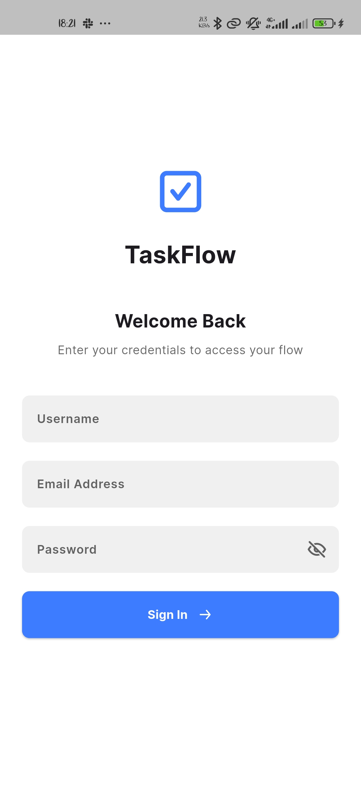 | 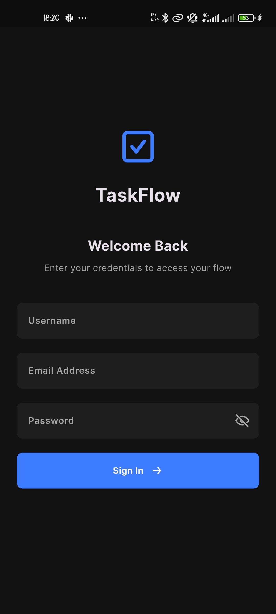 |
| **Dashboard** | 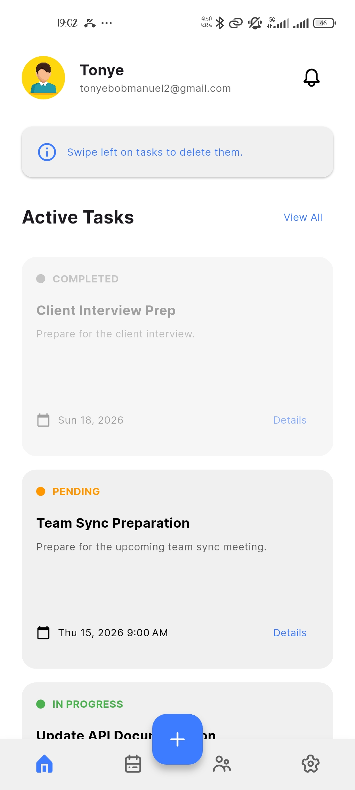 | 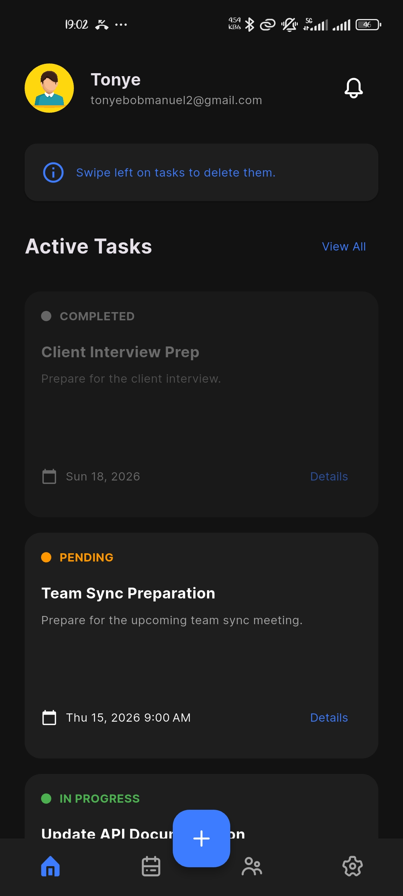 |
| **Profile** | 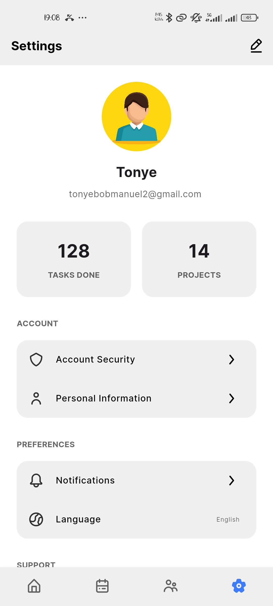 | 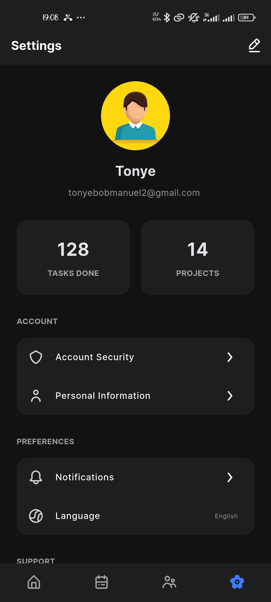 |
| **Edit Profile** |  | 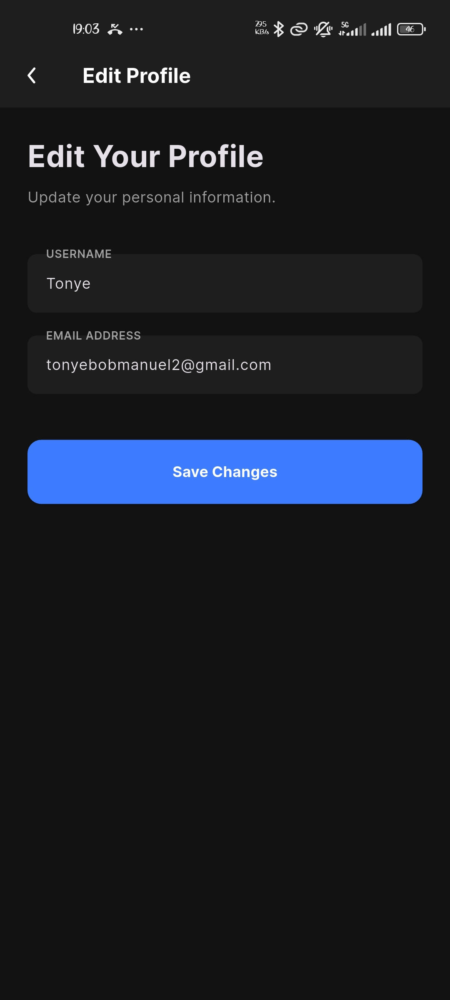 |
| **Schedule** | 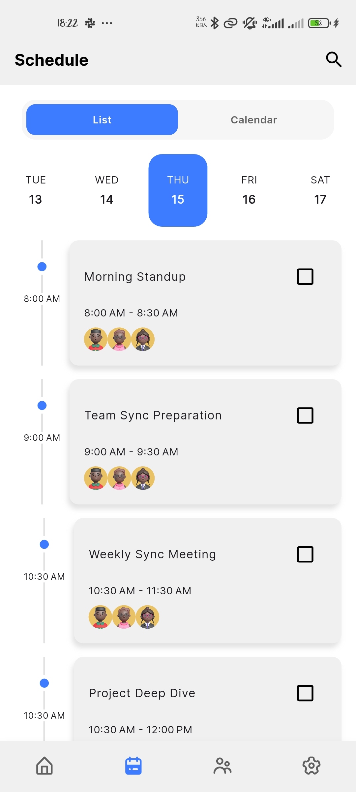 |  |
| **Schedule Calendar** | 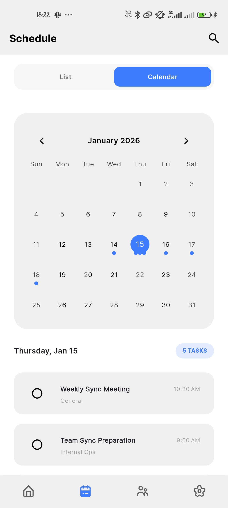 | 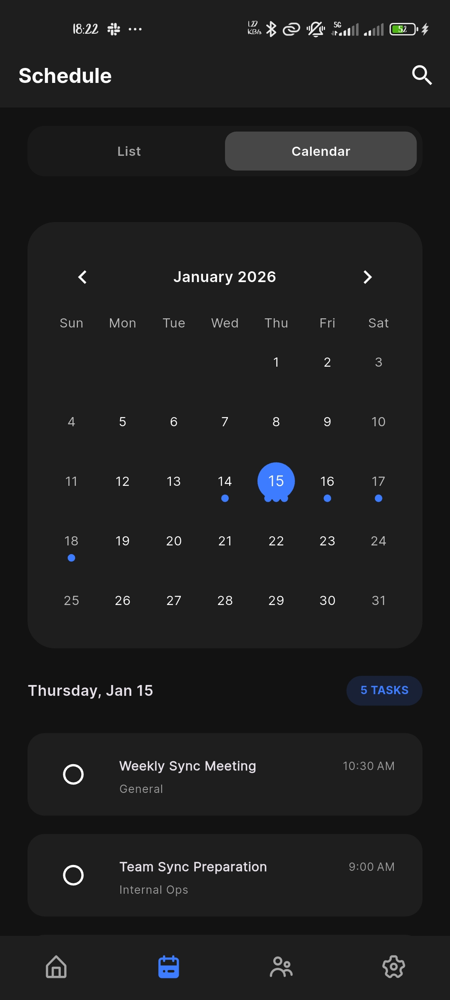 |
| **Teams** | 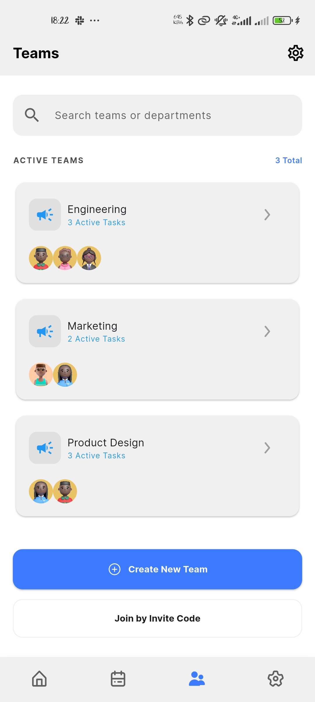 | 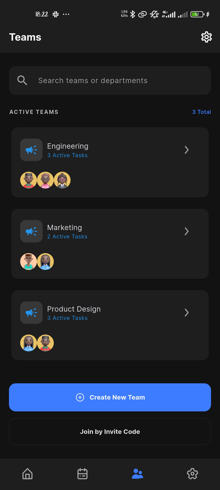 |
| **Create Task** | 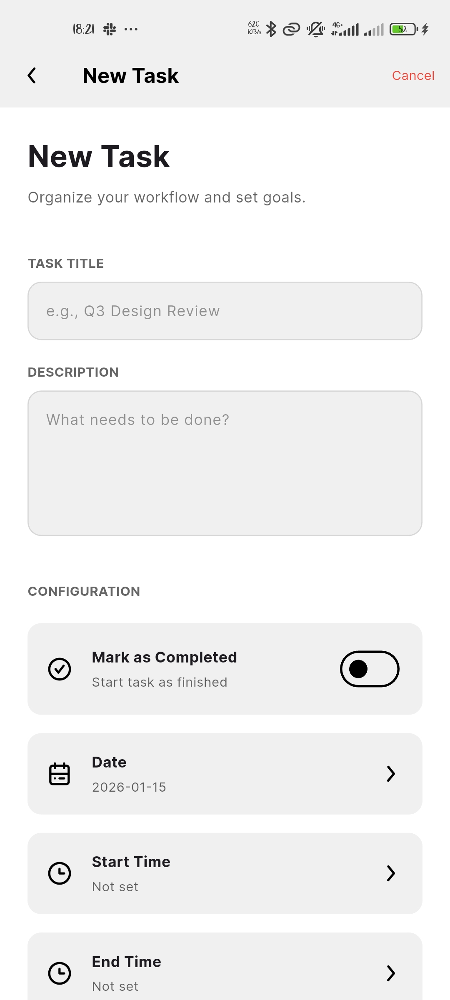 | 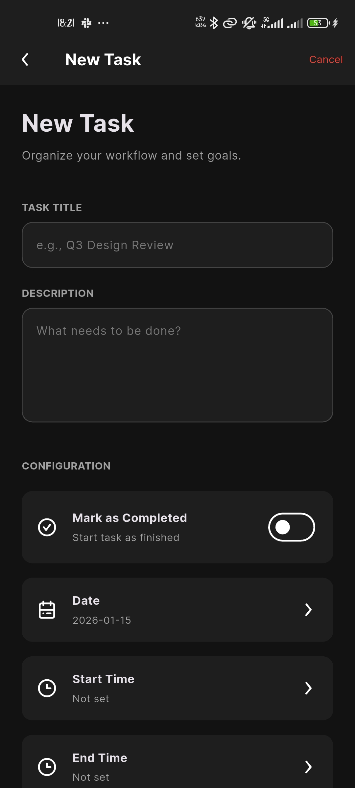 |

